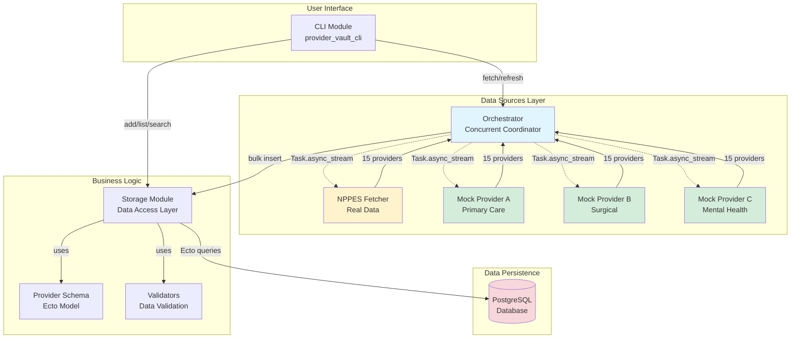
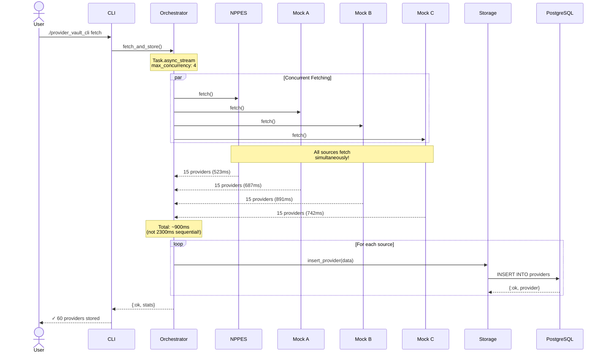
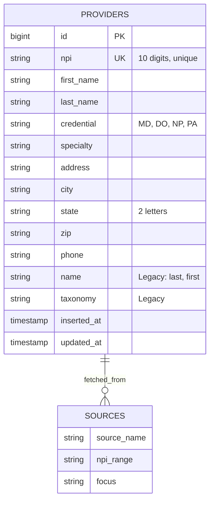
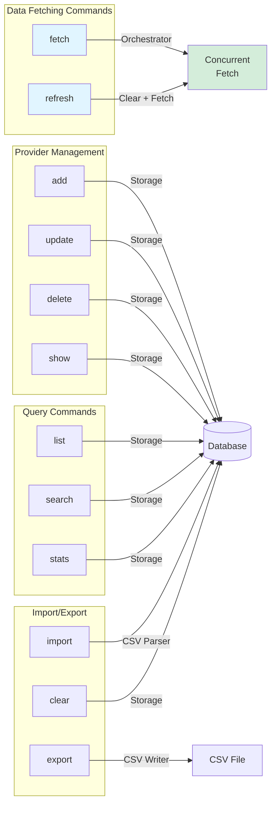
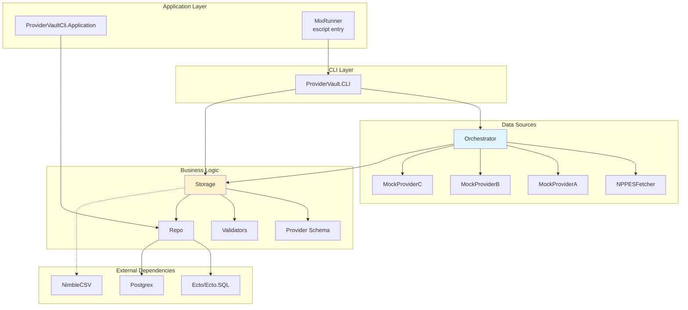
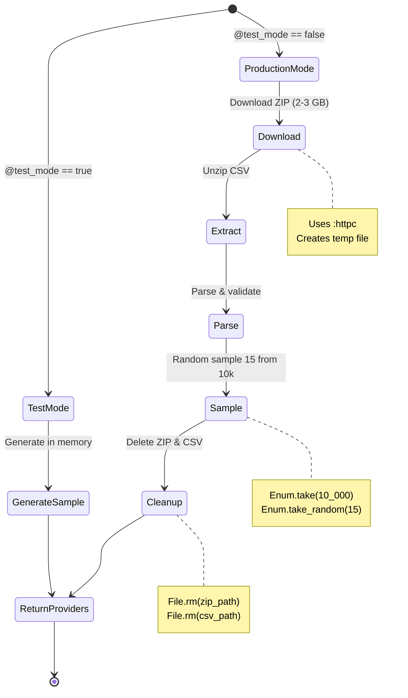
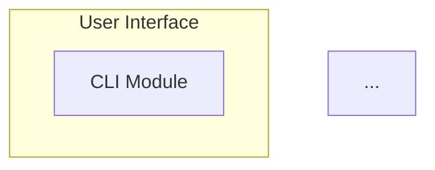

# Provider Vault - Mermaid Diagrams for README.md

## 1. System Architecture



---

## 2. Concurrent Data Fetching Flow



---

## 3. Database Schema



**NPI Ranges by Source:**
- NPPES: 1500000001-1500000015
- Mock A (Primary Care): 2000000001-2000000015
- Mock B (Surgical): 3000000001-3000000015
- Mock C (Mental Health): 4000000001-4000000015

---

## 4. CLI Command Structure



---

## 5. Module Dependencies



---

## 6. Data Flow: Fetch Operation

```mermaid
flowchart TD
    START([User: ./provider_vault_cli fetch])
    
    START --> CLI_FETCH[CLI.handle_fetch/0]
    CLI_FETCH --> ORCH_FETCH[Orchestrator.fetch_and_store/0]
    
    ORCH_FETCH --> ASYNC[Task.async_stream<br/>max_concurrency: 4]
    
    ASYNC --> PAR_START{Concurrent<br/>Execution}
    
    PAR_START -.->|Process 1| NPPES_FETCH[NPPES.fetch/0]
    PAR_START -.->|Process 2| MOCKA_FETCH[MockA.fetch/0]
    PAR_START -.->|Process 3| MOCKB_FETCH[MockB.fetch/0]
    PAR_START -.->|Process 4| MOCKC_FETCH[MockC.fetch/0]
    
    NPPES_FETCH --> NPPES_DATA[15 providers]
    MOCKA_FETCH --> MOCKA_DATA[15 providers]
    MOCKB_FETCH --> MOCKB_DATA[15 providers]
    MOCKC_FETCH --> MOCKC_DATA[15 providers]
    
    NPPES_DATA --> COLLECT[Collect Results]
    MOCKA_DATA --> COLLECT
    MOCKB_DATA --> COLLECT
    MOCKC_DATA --> COLLECT
    
    COLLECT --> PROCESS[Process & Store]
    
    PROCESS --> LOOP{For each<br/>provider}
    
    LOOP -->|validate| CHANGESET[Provider.changeset/2]
    CHANGESET --> INSERT[Repo.insert/1]
    INSERT --> DB[(PostgreSQL)]
    
    DB -->|success| COUNT[Increment stored count]
    DB -->|error| SKIP[Increment failed count]
    
    COUNT --> LOOP
    SKIP --> LOOP
    
    LOOP -->|done| STATS[Generate Statistics]
    STATS --> RETURN[Return {:ok, stats}]
    
    RETURN --> CLI_DISPLAY[CLI displays summary]
    CLI_DISPLAY --> END([User sees results])
    
    style ASYNC fill:#e1f5ff
    style PAR_START fill:#d4edda
    style DB fill:#f8d7da
```

---

## 7. Concurrent vs Sequential Comparison

```mermaid
gantt
    title Concurrent vs Sequential Execution
    dateFormat X
    axisFormat %Lms
    
    section Sequential (2,746ms)
    NPPES (586ms)    :s1, 0, 586
    MockA (412ms)    :s2, after s1, 412
    MockB (866ms)    :s3, after s2, 866
    MockC (434ms)    :s4, after s3, 434
    
    section Concurrent (891ms)
    NPPES (586ms)    :c1, 0, 586
    MockA (412ms)    :c2, 0, 412
    MockB (866ms)    :c3, 0, 866
    MockC (434ms)    :c4, 0, 434
```



**Performance Gain:** 3x faster with concurrency!

---

## 8. NPPES Fetcher State Machine (Production Mode)



---

## How to Use in README.md

Simply copy the Mermaid code blocks into your README.md:

````markdown
# Provider Vault

## Architecture Overview



## Concurrent Data Flow

```mermaid
sequenceDiagram
    actor User
    participant CLI
    ...
```
````

GitHub automatically renders Mermaid diagrams! 🎨
