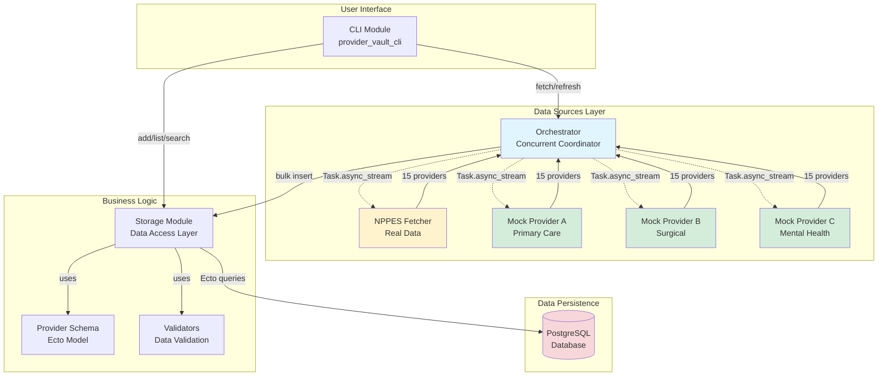
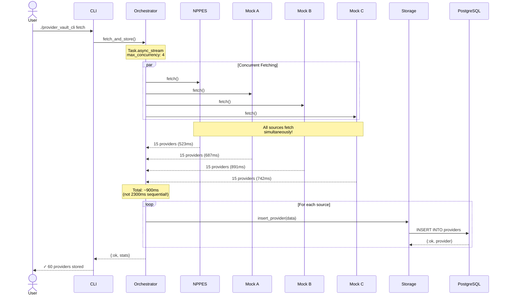
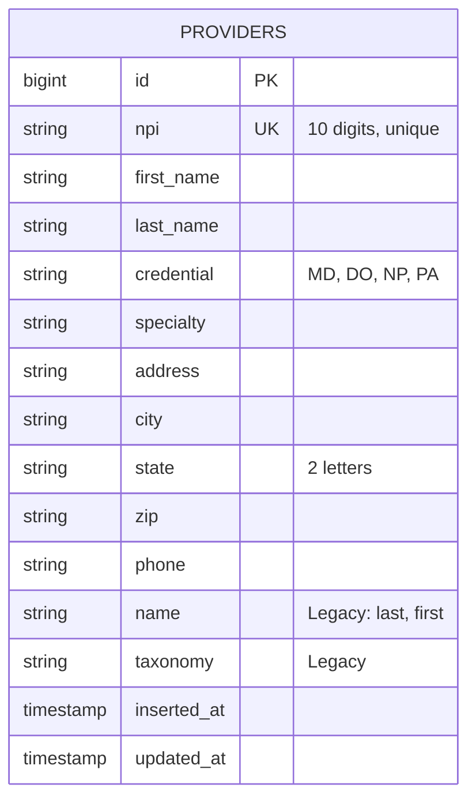

# Provider Vault

**A polyglot microservices application demonstrating concurrent data fetching and prompt engineering with Elixir and Python.**

[](https://elixir-lang.org/)
[](https://www.postgresql.org/)
[](https://www.python.org/)

---

## 🎯 Project Overview

Provider Vault is a learning project that demonstrates:
- **Elixir's concurrency model** using Task-based parallelism
- **Polyglot architecture** with Elixir and Python services
- **Real-world data integration** with NPPES provider database
- **Prompt engineering** and AI/LLM integration (Phase 3)

---

## 📊 System Architecture



---

## 🚀 Features

### Phase 1: Elixir CLI ✅
- PostgreSQL database integration
- CRUD operations for provider records
- CSV import/export
- Search and filtering
- Database statistics

### Phase 2: Concurrent Data Fetching ✅
- **4 concurrent data sources** (1 real, 3 mock)
- **Task-based parallelism** using `Task.async_stream`
- **3x performance improvement** (1 second vs 3 seconds sequential)
- Observable concurrent execution with logging
- Automatic cleanup of downloaded files

### Phase 3: Python & AI Integration 🔄
- Python FastAPI service
- LLM integration (Claude API/OpenAI)
- Prompt engineering experiments
- Natural language queries on provider data

---

## 🔄 Concurrent Data Fetching Flow



---

## 📦 Installation

### Prerequisites

- Elixir 1.14+
- PostgreSQL 14+
- Git

### Setup

```bash
# Clone the repository
git clone https://github.com/yourusername/provider_vault_cli.git
cd provider_vault_cli

# Install dependencies
mix deps.get

# Create database
createdb provider_vault_cli_repo

# Run migrations
mix ecto.migrate

# Build executable
mix escript.build
```

---

## 💻 Usage

### Fetch Provider Data

```bash
# Fetch from all 4 sources concurrently
./provider_vault_cli fetch

# Clear database and fetch fresh data
./provider_vault_cli refresh
```

**Example Output:**

```
🚀 Fetching provider data from all sources...

[info] === Starting concurrent fetch from 4 sources ===
[info] [NPPES] Starting fetch...
[info] [Mock-PrimaryCare] Starting fetch...
[info] [Mock-SurgicalSpec] Starting fetch...
[info] [Mock-MentalHealth] Starting fetch...
[info] [NPPES] Fetched 15 providers in 586ms
[info] [Mock-PrimaryCare] Fetched 15 providers in 412ms
[info] [Mock-SurgicalSpec] Fetched 15 providers in 866ms
[info] [Mock-MentalHealth] Fetched 15 providers in 434ms
[info] === Completed all fetches in 891ms ===

✓ Fetch completed successfully!

Database Summary:
─────────────────────────────────────
Total Providers:      60
Unique Specialties:   16
Unique States:        14
```

### Provider Management

```bash
# List providers
./provider_vault_cli list --limit 20

# Search providers
./provider_vault_cli search "Cardiology"
./provider_vault_cli search "Chicago"

# Show provider details
./provider_vault_cli show 1234567890

# Add provider
./provider_vault_cli add

# Update provider
./provider_vault_cli update 1234567890

# Delete provider
./provider_vault_cli delete 1234567890
```

### Data Import/Export

```bash
# Import from CSV
./provider_vault_cli import providers.csv

# Export to CSV
./provider_vault_cli export backup.csv

# Clear all data
./provider_vault_cli clear
```

### Statistics

```bash
./provider_vault_cli stats
```

---

## 📈 Performance: Concurrent vs Sequential

```mermaid
gantt
    title Concurrent vs Sequential Execution
    dateFormat X
    axisFormat %Lms
    
    section Sequential (2,746ms)
    NPPES (586ms)    :s1, 0, 586
    MockA (412ms)    :s2, after s1, 412
    MockB (866ms)    :s3, after s2, 866
    MockC (434ms)    :s4, after s3, 434
    
    section Concurrent (891ms)
    NPPES (586ms)    :c1, 0, 586
    MockA (412ms)    :c2, 0, 412
    MockB (866ms)    :c3, 0, 866
    MockC (434ms)    :c4, 0, 434
```



**Key Metrics:**
- **Sequential Time:** 2,746ms (sum of all fetches)
- **Concurrent Time:** 891ms (limited by slowest source)
- **Speedup:** 3x faster with concurrency!

---

## 🗄️ Database Schema



### Data Sources & NPI Ranges

| Source | NPI Range | Focus | Count |
|--------|-----------|-------|-------|
| **NPPES** | 1500000001-15 | Real provider data | 15 |
| **Mock A** | 2000000001-15 | Primary Care (Family Med, Pediatrics) | 15 |
| **Mock B** | 3000000001-15 | Surgical Specialists (Ortho, Cardio) | 15 |
| **Mock C** | 4000000001-15 | Mental Health (Psychiatry, Psychology) | 15 |

---

## 🏗️ Project Structure

```
provider_vault_cli/
├── lib/
│   ├── provider_vault/
│   │   ├── cli.ex                     # Command-line interface
│   │   ├── storage.ex                 # Data access layer
│   │   ├── provider.ex                # Ecto schema
│   │   ├── validators.ex              # Data validation
│   │   ├── repo.ex                    # Ecto repository
│   │   └── data_sources/
│   │       ├── nppes_fetcher.ex       # Real NPPES data
│   │       ├── mock_provider_a.ex     # Primary care mock
│   │       ├── mock_provider_b.ex     # Surgical mock
│   │       ├── mock_provider_c.ex     # Mental health mock
│   │       └── orchestrator.ex        # Concurrent coordinator
│   └── provider_vault_cli/
│       └── application.ex             # Application supervisor
├── priv/
│   └── repo/
│       └── migrations/                # Database migrations
├── config/
│   └── config.exs                     # Configuration
├── test/
├── mix.exs                            # Project configuration
└── README.md
```

---

## 🎓 Learning Outcomes

### Elixir Concepts Demonstrated

- **Task.async_stream** - Concurrent mapping pattern
- **Process isolation** - Fault tolerance
- **Pattern matching** - Result handling
- **Ecto** - Database abstraction
- **Supervision trees** - Application structure
- **Logging** - Observability

### Real-World Patterns

- ✅ Fetching from multiple APIs
- ✅ Parallel database operations
- ✅ Microservices orchestration
- ✅ Data aggregation
- ✅ Resilient distributed systems

---

## 🧪 Testing

```bash
# Run all tests
mix test

# Run with coverage
mix test --cover

# Run specific test
mix test test/storage_test.exs
```

---

## 🔧 Configuration

### Test Mode vs Production Mode

**Test Mode** (Current - `@test_mode true`):
- Generates sample data in memory
- No file downloads
- Instant execution (~500ms)

**Production Mode** (`@test_mode false`):
- Downloads real NPPES data (2-3 GB)
- Random sampling from 10k records
- Automatic file cleanup
- Execution time: ~10 seconds

To switch to production mode:

```elixir
# In lib/provider_vault/data_sources/nppes_fetcher.ex
@test_mode false  # Change from true to false
```

---

## 📚 Commands Reference

| Command | Description | Example |
|---------|-------------|---------|
| `fetch` | Fetch from all sources concurrently | `./provider_vault_cli fetch` |
| `refresh` | Clear DB and fetch fresh data | `./provider_vault_cli refresh` |
| `list` | List providers | `./provider_vault_cli list --limit 20` |
| `search` | Search providers | `./provider_vault_cli search "Surgery"` |
| `show` | Show provider details | `./provider_vault_cli show 1234567890` |
| `add` | Add new provider | `./provider_vault_cli add` |
| `update` | Update provider | `./provider_vault_cli update 1234567890` |
| `delete` | Delete provider | `./provider_vault_cli delete 1234567890` |
| `import` | Import from CSV | `./provider_vault_cli import file.csv` |
| `export` | Export to CSV | `./provider_vault_cli export backup.csv` |
| `stats` | Database statistics | `./provider_vault_cli stats` |
| `clear` | Clear all providers | `./provider_vault_cli clear` |
| `help` | Show help | `./provider_vault_cli help` |

---

## 🛠️ Development

### Adding a New Data Source

1. Create a new module in `lib/provider_vault/data_sources/`:

```elixir
defmodule ProviderVault.DataSources.MockProviderD do
  def fetch do
    # Your implementation
    {:ok, providers}
  end
end
```

2. Register in orchestrator (`orchestrator.ex`):

```elixir
@sources [
  # ... existing sources ...
  {MockProviderD, "Mock-YourSource"}
]
```

3. Recompile and test:

```bash
mix compile
./provider_vault_cli fetch
```

---

## 🐛 Troubleshooting

| Issue | Solution |
|-------|----------|
| Module not found | Run `mix compile` |
| Database connection error | Check PostgreSQL is running |
| Timeout errors | Increase timeout in `orchestrator.ex` |
| Duplicate NPI errors | Run `./provider_vault_cli clear` first |
| Compilation warnings | See `INTEGRATION_GUIDE.md` for fixes |

---

## 📖 Documentation

- **[INTEGRATION_GUIDE.md](INTEGRATION_GUIDE.md)** - Detailed setup and architecture
- **[QUICK_REFERENCE.md](QUICK_REFERENCE.md)** - Command cheat sheet
- **[CLAUDE.md](CLAUDE.md)** - Development notes and history
- **[MERMAID_DIAGRAMS.md](MERMAID_DIAGRAMS.md)** - All diagrams in one place

---

## 🗺️ Roadmap

- [x] **Phase 1:** Elixir CLI with PostgreSQL
- [x] **Phase 2:** Concurrent data fetching
- [ ] **Phase 3:** Python FastAPI service
- [ ] **Phase 4:** AI/LLM integration
- [ ] **Phase 5:** Phoenix web frontend

---

## 🤝 Contributing

This is a learning project, but contributions are welcome!

1. Fork the repository
2. Create your feature branch (`git checkout -b feature/amazing-feature`)
3. Commit your changes (`git commit -m 'Add amazing feature'`)
4. Push to the branch (`git push origin feature/amazing-feature`)
5. Open a Pull Request

---

## 📝 License

This project is licensed under the MIT License - see the LICENSE file for details.

---

## 🙏 Acknowledgments

- **NPPES** - National Plan and Provider Enumeration System
- **Elixir Community** - For excellent documentation and tools
- **PostgreSQL** - Reliable database system

---

## 📧 Contact

Don Fox - [@donfox](https://github.com/donfox)

Project Link: [https://github.com/donfox/provider_vault_cli](https://github.com/donfox/provider_vault_cli)

---

**Built with ❤️ using Elixir and PostgreSQL**
